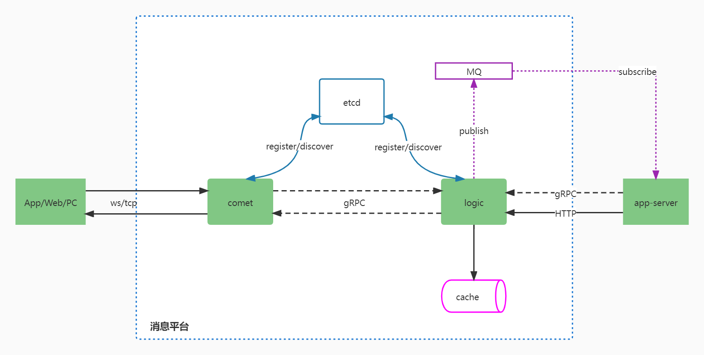

# 即时通讯系统消息网关

im是即时通讯系统的接入层平台，负责维护与客户端的长连接。



- comet: 作为消息平台的接入层服务，负责维护客户端的长连接，协议的编解码等，支持websocket和tcp协议。
- logic: 用于comet节点的调度，用户在线状态、comet节点状态等处理逻辑，并提供用于业务层服务访问的RPC接口。
- cache：高可用redis集群。仅供logic节点访问，存储用户在线状态，comet节点状态，以及相互间的映射关系。
- MQ： 消息队列。
- etcd：服务注册发现中心。
- App Server: 业务服务，如[dtalk即时通讯服务](https://github.com/txchat/dtalk)

## 开始

### 从源码编译

环境要求: 
1. Golang 1.17 or later, 参考[golang官方安装文档](https://go.dev/doc/install)

```shell
# 编译本机系统和指令集的可执行文件
$ make build

# 编译目标机器的可执行文件,例如
$ make build_linux_amd64
```
编译成功后目标执行文件在工程目录的target文件夹下。

运行服务命令：
```shell
$ ./target/comet -f ./target/comet.toml
$ ./target/logic -f ./target/logic.toml
```

### docker容器中运行

环境要求:
1. Golang 1.17 or later, 参考[golang官方安装文档](https://go.dev/doc/install)
2. docker engine version 20.10.17 or later, 安装参考[docker官方安装文档](https://docs.docker.com/get-docker/)

```shell
# 初始化docker环境
$ make init-compose

# 打包镜像及运行容器
$ make docker-compose-up

# 查看容器是否运行成功
$ make docker-compose-ps
```

### License

im is under the MIT license. See the [LICENSE](LICENSE) file for details.
