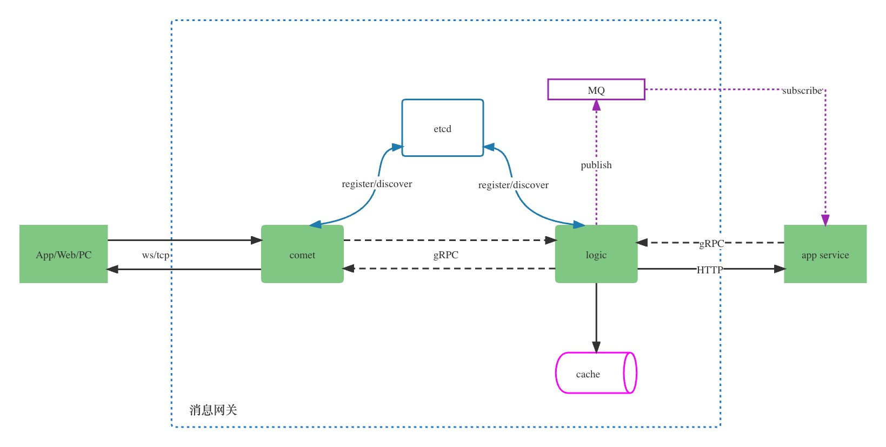

# 消息网关

**注意：** `main`分支在开发过程中可能处于不稳定甚至损坏的状态。

im目标是提供一个具有如下特征开箱即用的消息网关：
- 高可用：分布式设计，网关节点集群部署
- 高性能：面向高并发连接的池化设计和GC优化
- 流式协议：流式传输协议，支持基于四层TCP和七层websocket
- 面向连接：实现握手协议，提供插件化鉴权接口设计，握手过程对业务服务透明
- 自动RTO：应用层协议的超时重传机制
- 多种模式：提供单播、组播、广播的gRPC推送接口和组管理相关接口
- 消息透传：针对非可靠消息场景，提供透传支持直接将业务服务消息透传给客户端

## 架构

模块介绍：
- comet: 作为网关的接入层服务，负责维护客户端的长连接，协议的编解码等
- logic: comet节点的调度、状态变更等处理逻辑，提供向下的gRPC接口
- cache：供logic节点访问，存储用户连接和comet节点状态
- MQ：消息队列
- etcd：服务注册发现中心
- App Server: 业务服务

## 使用

### 回声服务
`examples`目录下的`echo`服务是一个使用网关的简单示例，查看[文档](examples/README.md)并运行代码和测试程序，了解如何快速使用网关编写业务代码。

### 即时通讯服务
[即时通讯服务](https://github.com/txchat/dtalk)是更复杂一些的业务服务，通过im网关服务提供的特性，并针对即时通讯场景实现消息可靠送达，离线推送，群用户管理等相关功能。

## 贡献

克隆代码到本地，在修改代码时请结合`make fmt`格式化，`make linter`做代码检查。

### License

im is under the MIT license. See the [LICENSE](LICENSE) file for details.
