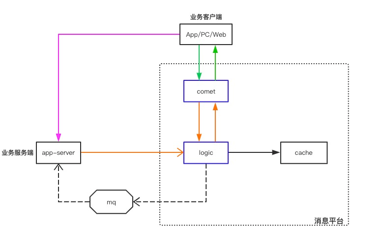

goim v2.0
==============

goim is a im server writen by golang.

## Features
 * Light weight
 * High performance
 * Pure Golang
 * Supports single push, multiple push and broadcasting
 * Supports one key to multiple subscribers (Configurable maximum subscribers count)
 * Supports heartbeats (Application heartbeats, TCP, KeepAlive, HTTP long pulling)
 * Supports authentication (Unauthenticated user can't subscribe)
 * Supports multiple protocols (WebSocket，TCP，HTTP）
 * Scalable architecture (Unlimited dynamic `comet` and `logic` modules)
 * Asynchronous push notification based on Kafka

## Architecture


## Quick Start

### Dependencies
 * kakfa: 消息队列
 * redis: 保存客户端连接信息
 * etcd: 提供服务注册/发现， comet、logic 服务注册在 etcd

docker 快速启动相关依赖：
```
 docker-compose -f benchmarks/kafka-docker-compose.yml up -d
 docker run -d -p 6379:6379 redis
 docker run -d -p 2379:2379 -p 2380:2380 --name etcd-v3.4.13 quay.io/coreos/etcd:v3.4.13 /usr/local/bin/etcd \ 
  --name s1 \
  --data-dir /etcd-data \
  --listen-client-urls http://0.0.0.0:2379 \
  --advertise-client-urls http://0.0.0.0:2379 \
  --listen-peer-urls http://0.0.0.0:2380 \
  --initial-advertise-peer-urls http://0.0.0.0:2380 \
  --initial-cluster s1=http://0.0.0.0:2380 \
  --initial-cluster-token tkn \
  --initial-cluster-state new \
  --log-level info \
  --logger zap \
  --log-outputs stderr
```

### Build
```
    make build
```

### Run
```
    make run
    make stop

    // or
    nohup target/logic -conf=target/logic.toml -logtostderr 2>&1 > target/logic.log &
    nohup target/comet -conf=target/comet.toml -logtostderr 2>&1 > target/comet.log &
```

### Configuration
You can view the comments in `target/comet.toml`, `target/logic.toml` to understand the meaning of the config.

## Document
[Protocol](./docs/proto.md)